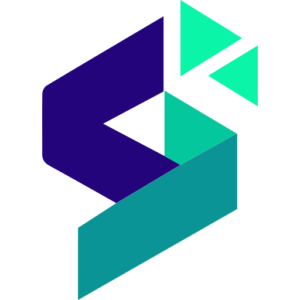

# SiiWay Icon

SiiWay Team 官方图标.

  

---

<!-- AUTO_FILE_LIST_START -->

- [README.md](./README.md) *(2.3K)*
- [**favicon/**](./favicon/)
  - [android-chrome-192x192.png](./favicon/android-chrome-192x192.png) *(10.5K)* - **192x192**
  - [android-chrome-512x512.png](./favicon/android-chrome-512x512.png) *(44.9K)* - **512x512**
  - [apple-touch-icon.png](./favicon/apple-touch-icon.png) *(9.4K)* - **180x180**
  - [favicon-16x16.png](./favicon/favicon-16x16.png) *(597B)* - **16x16**
  - [favicon-32x32.png](./favicon/favicon-32x32.png) *(1.1K)* - **32x32**
  - [favicon.ico](./favicon/favicon.ico) *(15.0K)* - **48x48**
  - [site.webmanifest](./favicon/site.webmanifest) *(263B)* - **Webmanifest config file**
- [**favicon-dark/**](./favicon-dark/)
  - [android-chrome-192x192.png](./favicon-dark/android-chrome-192x192.png) *(7.9K)* - **192x192**
  - [android-chrome-512x512.png](./favicon-dark/android-chrome-512x512.png) *(28.4K)* - **512x512**
  - [apple-touch-icon.png](./favicon-dark/apple-touch-icon.png) *(7.2K)* - **180x180**
  - [favicon-16x16.png](./favicon-dark/favicon-16x16.png) *(509B)* - **16x16**
  - [favicon-32x32.png](./favicon-dark/favicon-32x32.png) *(1022B)* - **32x32**
  - [favicon.ico](./favicon-dark/favicon.ico) *(1.6K)* - **48x48**
  - [site.webmanifest](./favicon-dark/site.webmanifest) *(263B)* - **Webmanifest config file**
- [**favicon-light/**](./favicon-light/)
  - [android-chrome-192x192.png](./favicon-light/android-chrome-192x192.png) *(9.3K)* - **192x192**
  - [android-chrome-512x512.png](./favicon-light/android-chrome-512x512.png) *(33.7K)* - **512x512**
  - [apple-touch-icon.png](./favicon-light/apple-touch-icon.png) *(8.4K)* - **180x180**
  - [favicon-16x16.png](./favicon-light/favicon-16x16.png) *(552B)* - **16x16**
  - [favicon-32x32.png](./favicon-light/favicon-32x32.png) *(1.1K)* - **32x32**
  - [favicon.ico](./favicon-light/favicon.ico) *(1.8K)* - **48x48**
  - [site.webmanifest](./favicon-light/site.webmanifest) *(263B)* - **Webmanifest config file**
- [icon-dark.svg](./icon-dark.svg) *(1.6K)* - **Dark mode source**
- [icon-light.svg](./icon-light.svg) *(1.6K)* - **Light mode source**
- [icon.svg](./icon.svg) *(1.6K)* - **Source**

<!-- AUTO_FILE_LIST_END -->

---

本为 SiIWay Team **原创图标**.
