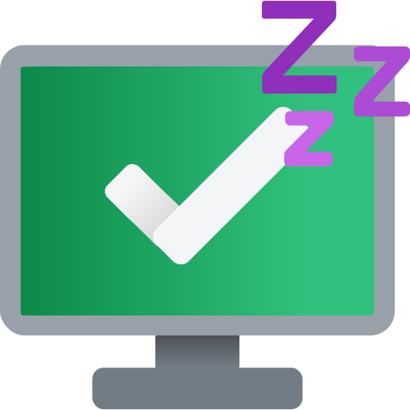
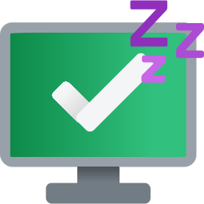
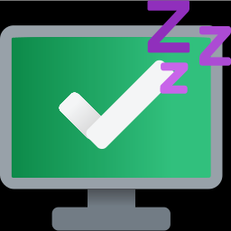

# Sleepy Icon

Sleepy Project 项目图标.

  

---

<!-- AUTO_FILE_LIST_START -->

- [README.md](./README.md)
- [**favicon/**](./favicon/)
  - [android-chrome-192x192.png](./favicon/android-chrome-192x192.png) - 192x192
  - [android-chrome-512x512.png](./favicon/android-chrome-512x512.png) - 512x512
  - [apple-touch-icon.png](./favicon/apple-touch-icon.png) - 180x180
  - [favicon-16x16.png](./favicon/favicon-16x16.png) - 16x16
  - [favicon-32x32.png](./favicon/favicon-32x32.png) - 32x32
  - [favicon.ico](./favicon/favicon.ico) - 48x48
  - [site.webmanifest](./favicon/site.webmanifest) - Webmanifest config file
- [**favicon-dark/**](./favicon-dark/)
  - [android-chrome-192x192.png](./favicon-dark/android-chrome-192x192.png) - 192x192
  - [android-chrome-512x512.png](./favicon-dark/android-chrome-512x512.png) - 512x512
  - [apple-touch-icon.png](./favicon-dark/apple-touch-icon.png) - 180x180
  - [favicon-16x16.png](./favicon-dark/favicon-16x16.png) - 16x16
  - [favicon-32x32.png](./favicon-dark/favicon-32x32.png) - 32x32
  - [favicon.ico](./favicon-dark/favicon.ico) - 48x48
  - [site.webmanifest](./favicon-dark/site.webmanifest) - Webmanifest config file
- [**favicon-light/**](./favicon-light/)
  - [android-chrome-192x192.png](./favicon-light/android-chrome-192x192.png) - 192x192
  - [android-chrome-512x512.png](./favicon-light/android-chrome-512x512.png) - 512x512
  - [apple-touch-icon.png](./favicon-light/apple-touch-icon.png) - 180x180
  - [favicon-16x16.png](./favicon-light/favicon-16x16.png) - 16x16
  - [favicon-32x32.png](./favicon-light/favicon-32x32.png) - 32x32
  - [favicon.ico](./favicon-light/favicon.ico) - 48x48
  - [site.webmanifest](./favicon-light/site.webmanifest) - Webmanifest config file
- [icon-dark.svg](./icon-dark.svg) - Dark mode source
- [icon-light.svg](./icon-light.svg) - Light mode source
- [icon.svg](./icon.svg) - Source
- [old.svg](./old.svg) - Old version

<!-- AUTO_FILE_LIST_END -->

---

本为 SiIWay Team **原创图标**.
