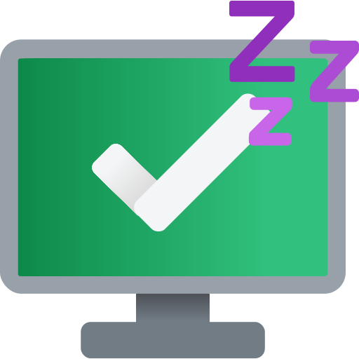
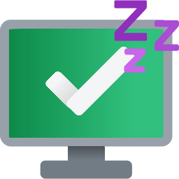
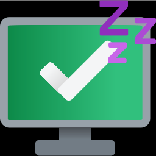

# Sleepy Icon

Sleepy Project 项目图标.

  

---

<!-- AUTO_FILE_LIST_START -->

- **border/**
  - [android-chrome-192x192.png](./border/android-chrome-192x192.png) *(15.8K)* - **192x192**
  - [android-chrome-512x512.png](./border/android-chrome-512x512.png) *(56.3K)* - **512x512**
  - [apple-touch-icon.png](./border/apple-touch-icon.png) *(14.8K)* - **180x180**
  - [favicon-16x16.png](./border/favicon-16x16.png) *(651B)* - **16x16**
  - [favicon-32x32.png](./border/favicon-32x32.png) *(1.5K)* - **32x32**
  - [favicon.ico](./border/favicon.ico) *(4.8K)* - **48x48**
  - [site.webmanifest](./border/site.webmanifest) *(426B)* - **Webmanifest config file**
- **border-dark/**
  - [android-chrome-192x192.png](./border-dark/android-chrome-192x192.png) *(16.1K)* - **192x192**
  - [android-chrome-512x512.png](./border-dark/android-chrome-512x512.png) *(56.9K)* - **512x512**
  - [apple-touch-icon.png](./border-dark/apple-touch-icon.png) *(15.1K)* - **180x180**
  - [favicon-16x16.png](./border-dark/favicon-16x16.png) *(627B)* - **16x16**
  - [favicon-32x32.png](./border-dark/favicon-32x32.png) *(1.5K)* - **32x32**
  - [favicon.ico](./border-dark/favicon.ico) *(6.7K)* - **48x48**
  - [site.webmanifest](./border-dark/site.webmanifest) *(426B)* - **Webmanifest config file**
- **border-light/**
  - [android-chrome-192x192.png](./border-light/android-chrome-192x192.png) *(16.1K)* - **192x192**
  - [android-chrome-512x512.png](./border-light/android-chrome-512x512.png) *(57K)* - **512x512**
  - [apple-touch-icon.png](./border-light/apple-touch-icon.png) *(15.1K)* - **180x180**
  - [favicon-16x16.png](./border-light/favicon-16x16.png) *(632B)* - **16x16**
  - [favicon-32x32.png](./border-light/favicon-32x32.png) *(1.5K)* - **32x32**
  - [favicon.ico](./border-light/favicon.ico) *(6.7K)* - **48x48**
  - [site.webmanifest](./border-light/site.webmanifest) *(426B)* - **Webmanifest config file**
- **favicon/**
  - [android-chrome-192x192.png](./favicon/android-chrome-192x192.png) *(23.2K)* - **192x192**
  - [android-chrome-512x512.png](./favicon/android-chrome-512x512.png) *(72.9K)* - **512x512**
  - [apple-touch-icon.png](./favicon/apple-touch-icon.png) *(20.9K)* - **180x180**
  - [favicon-16x16.png](./favicon/favicon-16x16.png) *(818B)* - **16x16**
  - [favicon-32x32.png](./favicon/favicon-32x32.png) *(2K)* - **32x32**
  - [favicon.ico](./favicon/favicon.ico) *(6.5K)* - **48x48**
  - [site.webmanifest](./favicon/site.webmanifest) *(426B)* - **Webmanifest config file**
- **favicon-dark/**
  - [android-chrome-192x192.png](./favicon-dark/android-chrome-192x192.png) *(23.4K)* - **192x192**
  - [android-chrome-512x512.png](./favicon-dark/android-chrome-512x512.png) *(73.2K)* - **512x512**
  - [apple-touch-icon.png](./favicon-dark/apple-touch-icon.png) *(21K)* - **180x180**
  - [favicon-16x16.png](./favicon-dark/favicon-16x16.png) *(803B)* - **16x16**
  - [favicon-32x32.png](./favicon-dark/favicon-32x32.png) *(2K)* - **32x32**
  - [favicon.ico](./favicon-dark/favicon.ico) *(6.7K)* - **48x48**
  - [site.webmanifest](./favicon-dark/site.webmanifest) *(426B)* - **Webmanifest config file**
- **favicon-light/**
  - [android-chrome-192x192.png](./favicon-light/android-chrome-192x192.png) *(23.3K)* - **192x192**
  - [android-chrome-512x512.png](./favicon-light/android-chrome-512x512.png) *(73.2K)* - **512x512**
  - [apple-touch-icon.png](./favicon-light/apple-touch-icon.png) *(21K)* - **180x180**
  - [favicon-16x16.png](./favicon-light/favicon-16x16.png) *(809B)* - **16x16**
  - [favicon-32x32.png](./favicon-light/favicon-32x32.png) *(2K)* - **32x32**
  - [favicon.ico](./favicon-light/favicon.ico) *(6.7K)* - **48x48**
  - [site.webmanifest](./favicon-light/site.webmanifest) *(426B)* - **Webmanifest config file**
- [README.md](./README.md) *(4.3K)*
- [border-dark.svg](./border-dark.svg) *(240.2K)* - **Dark mode source with border**
- [border-light.svg](./border-light.svg) *(240.2K)* - **Light mode source with border**
- [border.svg](./border.svg) *(240.1K)* - **Source with border**
- [icon-dark.svg](./icon-dark.svg) *(240.1K)* - **Dark mode source**
- [icon-light.svg](./icon-light.svg) *(240.1K)* - **Light mode source**
- [icon.svg](./icon.svg) *(240.1K)* - **Source**
- [old.svg](./old.svg) *(33K)*

<!-- AUTO_FILE_LIST_END -->

---

本为 SiIWay Team **原创图标**.
