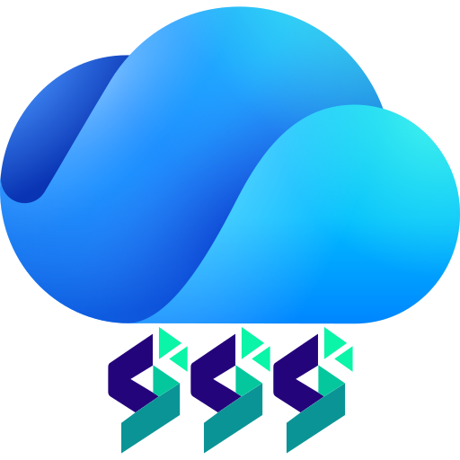
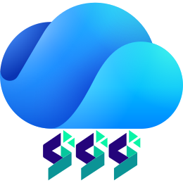
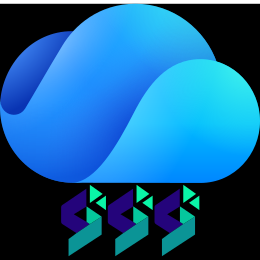

# SWDrive Icon

SiiWay Drive (SWDrive) 网盘用图标.

  

---

<!-- AUTO_FILE_LIST_START -->

- [README.md](./README.md) *(2.6K)* - **Directory README**
- **favicon/**
  - [android-chrome-192x192.png](./favicon/android-chrome-192x192.png) *(30.8K)* - **192x192**
  - [android-chrome-512x512.png](./favicon/android-chrome-512x512.png) *(139.4K)* - **512x512**
  - [apple-touch-icon.png](./favicon/apple-touch-icon.png) *(27.8K)* - **180x180**
  - [favicon-16x16.png](./favicon/favicon-16x16.png) *(848B)* - **16x16**
  - [favicon-32x32.png](./favicon/favicon-32x32.png) *(2.1K)* - **32x32**
  - [favicon.ico](./favicon/favicon.ico) *(15.0K)* - **48x48**
  - [site.webmanifest](./favicon/site.webmanifest) *(263B)* - **Webmanifest config file**
- **favicon-dark/**
  - [android-chrome-192x192.png](./favicon-dark/android-chrome-192x192.png) *(25.5K)* - **192x192**
  - [android-chrome-512x512.png](./favicon-dark/android-chrome-512x512.png) *(101.8K)* - **512x512**
  - [apple-touch-icon.png](./favicon-dark/apple-touch-icon.png) *(23.0K)* - **180x180**
  - [favicon-16x16.png](./favicon-dark/favicon-16x16.png) *(737B)* - **16x16**
  - [favicon-32x32.png](./favicon-dark/favicon-32x32.png) *(1.9K)* - **32x32**
  - [favicon.ico](./favicon-dark/favicon.ico) *(3.2K)* - **48x48**
  - [site.webmanifest](./favicon-dark/site.webmanifest) *(263B)* - **Webmanifest config file**
- **favicon-light/**
  - [android-chrome-192x192.png](./favicon-light/android-chrome-192x192.png) *(26.3K)* - **192x192**
  - [android-chrome-512x512.png](./favicon-light/android-chrome-512x512.png) *(105.3K)* - **512x512**
  - [apple-touch-icon.png](./favicon-light/apple-touch-icon.png) *(23.6K)* - **180x180**
  - [favicon-16x16.png](./favicon-light/favicon-16x16.png) *(749B)* - **16x16**
  - [favicon-32x32.png](./favicon-light/favicon-32x32.png) *(2.0K)* - **32x32**
  - [favicon.ico](./favicon-light/favicon.ico) *(3.3K)* - **48x48**
  - [site.webmanifest](./favicon-light/site.webmanifest) *(263B)* - **Webmanifest config file**
- [icon-dark.svg](./icon-dark.svg) *(9.4K)* - **Dark mode source**
- [icon-light.svg](./icon-light.svg) *(9.4K)* - **Light mode source**
- [icon.svg](./icon.svg) *(9.4K)* - **Source**
- [old.svg](./old.svg) *(4.2K)* - **Old version**

<!-- AUTO_FILE_LIST_END -->

---

# From

OneDrive Icon

> *Wikipedia:*
> 本标志图片仅包含简单的几何图形或文字，没有达到受版权保护所需的原创性门槛，故属于**公有领域**。虽然不受版权保护，本图仍受到其他限制。
